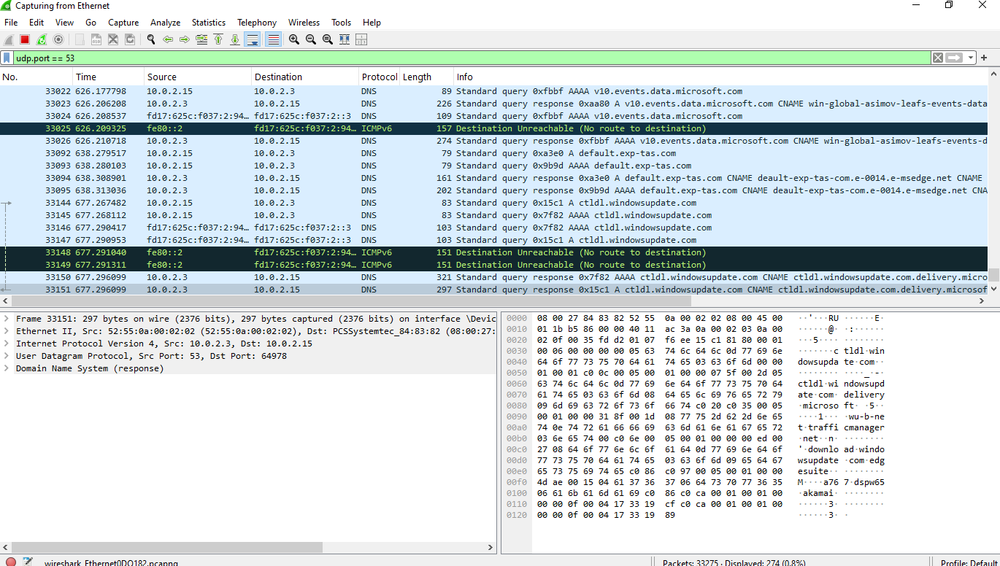
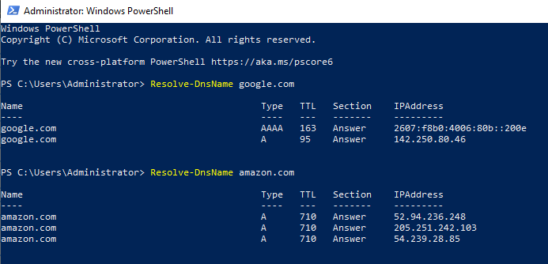
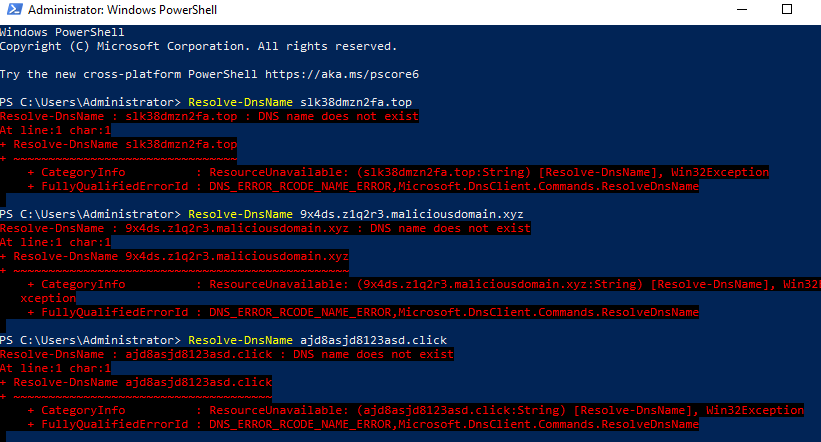
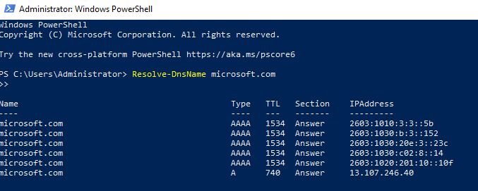
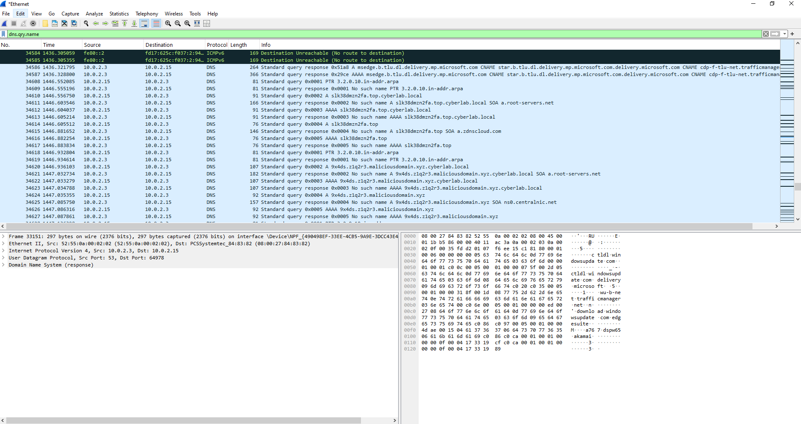
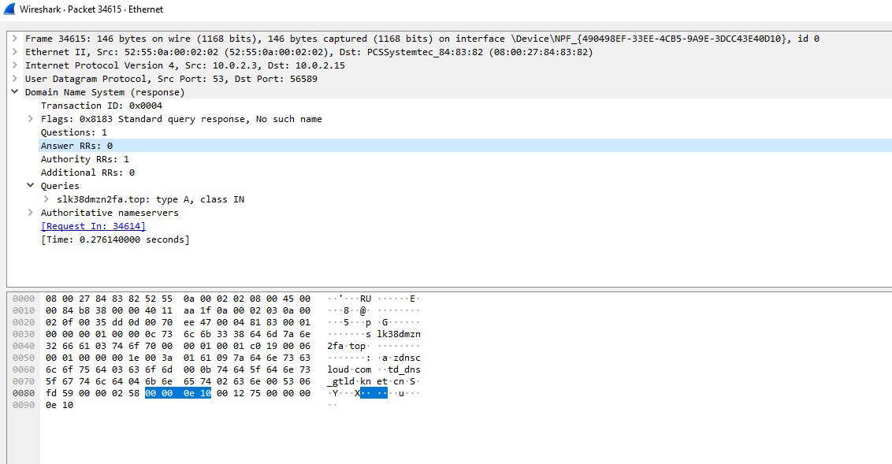

# Suspicious DNS Query Detection Wireshark Lab

## 🧠 Scenario: Monday Morning DNS Alert
You’re a Tier 1 SOC Analyst starting your Monday shift. An alert from Microsoft Defender flags a suspicious DNS query:

> **Domain:** `slk38dmzn2fa.top`  
> **Time:** 2:33 AM  
> **Device:** `RetailCo-Laptop042`  
> **Tactic:** Command-and-Control (MITRE T1071.004)`

Your job: Simulate this activity, capture it in Wireshark, and learn how to recognize abnormal DNS behavior.

---

## 🎯 Lab Goals
- Simulate normal vs suspicious DNS lookups
- Capture and analyze DNS traffic with Wireshark
- Understand DNS behavior in Command-and-Control (C2) activity

---

## 🧪 Step 1: Open Wireshark and Set the Filter
1. Launch Wireshark
2. Select your active network interface (Ethernet or Wi-Fi)
3. Set the capture filter:
   ```
   udp.port == 53
   ```
4. Start the capture



---

## 🧪 Step 2: Baseline DNS Lookups (Normal Domains)
In PowerShell:
```powershell
Resolve-DnsName google.com
Resolve-DnsName amazon.com
```



---

## 🧪 Step 3: Simulate Suspicious Queries
Run DNS lookups for shady/random domains:
```powershell
Resolve-DnsName slk38dmzn2fa.top
Resolve-DnsName 9x4ds.z1q2r3.maliciousdomain.xyz
Resolve-DnsName ajd8asjd8123asd.click
```



These mimic malware trying to reach a C2 server using a Domain Generation Algorithm (DGA).

---

## 🧪 Step 3B: Run a Successful Query for Contrast
```powershell
Resolve-DnsName microsoft.com
```



---

## 🧪 Step 4: View DNS Query Names in Wireshark
1. Stop the capture
2. Apply display filter:
   ```
   dns.qry.name
   ```



---

## 🧪 Step 5: Investigate Suspicious Packet
- Click a suspicious domain query
- Expand `Domain Name System (response)`
- Note the query name, response flags, and answer count



---

## 🧠 Key Takeaways
- DNS queries to random domains and unusual TLDs can indicate malware activity
- Even failed queries are valuable—they may reveal attempted beaconing to a C2 server
- Wireshark helps you break down what was asked, what responded, and whether it succeeded

---

## 📝 Reflection Questions
1. **Why does DNS use UDP on port 53?**  
   UDP is fast and connectionless—ideal for lightweight DNS queries.

2. **Why do malware authors use random domain names?**  
   To evade detection by constantly changing the destination, using a Domain Generation Algorithm (DGA).

3. **Why is a failed DNS query still important?**  
   Because it may be part of a scanning or beaconing attempt to find an active command-and-control (C2) server.

---
